<!-- .slide: class="title-slide" -->
# Different Routes of Reaction Time Slowing in Cognitive Development and Aging

### Shifted Weibull Decomposition via Hierarchical Bayesian Modeling

Presenter: Wen-Sheng  
Date: 2026.03.16

---

## Outline
 

1. **Background** — Processing speed across the lifespan; why mean RT is not enough
2. **Methods** — Tablet-based SRT/MT task; shifted Weibull + HBM
3. **Results & Discussion** — Dissociable routes of slowing; children are not small elderly

---

<!-- .slide: class="section-divider" -->
## Background

---

## The U-Shaped RT Trajectory
 

- SRT **decreases** from childhood through young adulthood (Kail, 1991)
- SRT **increases** from young adulthood through old age (Salthouse, 1996) 
- ~0.5 ms/year slowing from age 20 in 1,200+ adults (Fozard et al., 1994) 
- Slowing begins mid-20s, accelerates after 60 in 7,000+ UK adults (Der & Deary, 2006) 
- Confirmed in >200,000 web-based participants (Talboom et al., 2021)
- The U-shape parallels **white matter myelination** trajectories (Bartzokis et al., 2010; Chevalier et al., 2015).

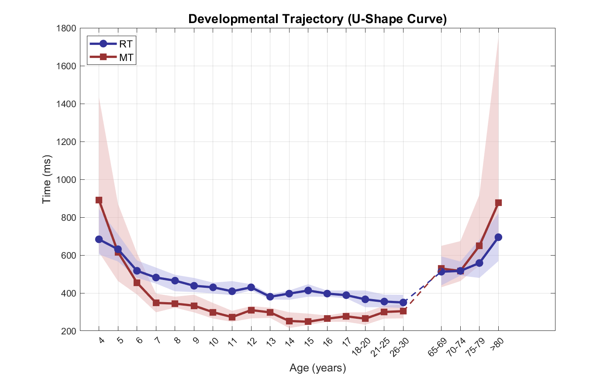

---

## Proportional Slowing Theory
 

The dominant explanation treats this U-shaped trajectory as reflecting a **single, unitary** speed factor:

- A single multiplicative factor predicts older adults' RTs from young adults' RTs (Cerella, 1985; Cerella & Hale, 1994)
- Children's RTs also scale proportionally with young adults' (Cerella & Hale, 1994)
- Implies a **single biological mechanism** (e.g., neural transmission speed) governs all age-related slowing

---

## But SRT Is Not a Single Process

However, even a "simple" reaction time engages a chain of **separable stages** (Sanders, 1998; Sternberg, 1969):

1. **Sensory transduction** — peripheral encoding
2. **Temporal preparation** — building readiness for the response
3. **Sustained attention** — maintaining readiness across trials
4. **Motor programming** — specifying the movement
5. **Motor initiation** — executing the release

If slowing were truly unitary, **all of these stages should slow proportionally**.

---

## Evidence Against Unitary Slowing - 1
 

Hardwick et al. (2022) separated **preparation** from **initiation** using a forced-RT paradigm (ages 21–80):
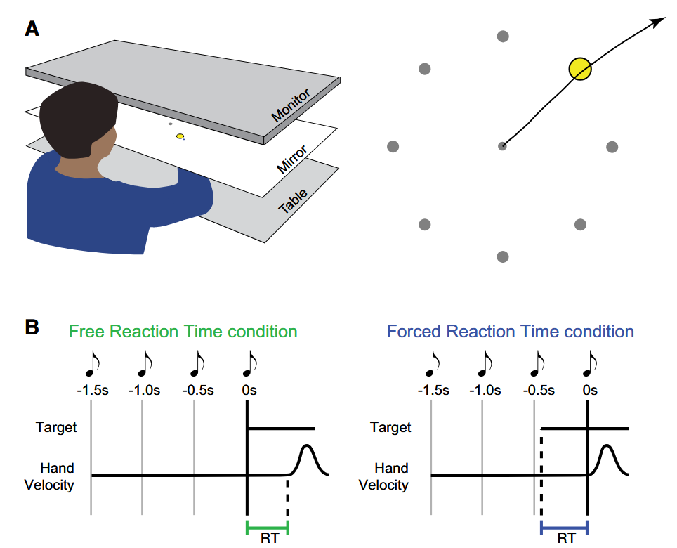

---
## Evidence Against Unitary Slowing - 2
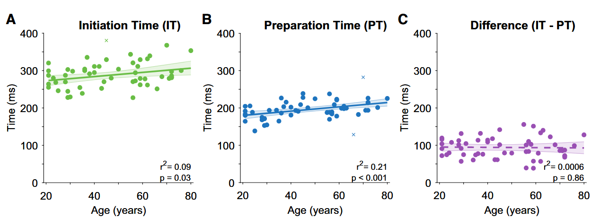

- Both free RT (voluntary initiation) and forced RT (minimum preparation time) **increased with age** 
- Yet the **delay between preparation and initiation remained invariant (~90 ms)** across ages  
- This means older adults are not more hesitant — they are **slower to prepare**, while the initiation buffer is unchanged

This selective vulnerability directly contradicts proportional slowing: if a single factor governed all temporal components, every stage should scale together — but **preparation and initiation dissociate**.

---

## Beyond Mean RT

A component-level decomposition requires going beyond summary statistics. Two participants can have **identical mean RTs** but completely different distributions:

- One responds near the mean on every trial (consistent)
- One produces fast responses + occasional very slow outliers (attentional lapses)

**Intraindividual variability (IIV):**

- IIV predicts cognitive decline beyond mean RT (Dykiert et al., 2012)
- Children's IIV decreases across development, sometimes exceeding mean RT changes (Williams et al., 2005)

We need a **distributional approach** to decompose what drives the U-shaped trajectory.

---

## The Shifted Weibull Distribution
 

$$f(x;\,\theta) = \frac{\kappa}{\lambda}\left(\frac{x - t_0}{\lambda}\right)^{\kappa-1} e^{-\left(\frac{x-t_0}{\lambda}\right)^{\kappa}}, \quad x > t_0$$

| Parameter | Symbol | Cognitive interpretation |
|---|---|---|
| **Shift** | $t_0$ | Irreducible minimum latency; **peripheral processes** |
| **Scale** | $\lambda$ | Spread above the floor; **central processing efficiency** |
| **Shape** | $\kappa$ | Distributional skewness; **trial-to-trial consistency** |

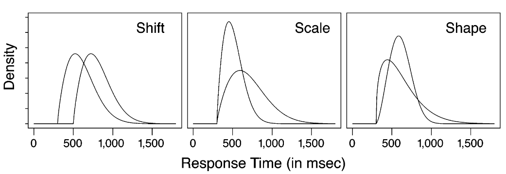

Selective influence evidence: stimulus difficulty affects $\lambda$ without altering $t_0$ (Rouder et al., 2005).

---

## Why Hierarchical Bayesian Modeling?

**The problem:** Tablet-based tasks yield many participants but **few trials per person** (20 here). MLE is unstable with small trial counts (>100 trials).

**The HBM solution — partial pooling:**

- Individual parameters are draws from a group-level distribution
- Estimates are a principled compromise between own data and group structure
- Degree of shrinkage $\propto$ individual vs. group precision
- Full posterior distributions propagate uncertainty
- Framework designed specifically for Weibull (Rouder et al., 2003, 2005)

---

## Research Questions

> 1. Do the three Weibull parameters form a **coherent latent factor** (unitary speed), or are they empirically distinct?

> 2. Do children and older adults show the **same or different** parametric profiles relative to young adults?

> 3. Does the **correlation structure** among parameters change across age groups (dedifferentiation hypothesis)?

---

<!-- .slide: class="section-divider" -->
## Methods

---

## Participants

**Final sample: *N* = 1,652** (exclusions: <16 valid trials)

| Age Group | *N* | Male/Female | Mean Age (*SD*) |
|---|---|---|---|
| Young children (4–6 y) | 110 | 65/45 | 5.4 (0.8) |
| Children (7–12 y) | 117 | 94/23 | 9.4 (1.6) |
| Adolescents (13–17 y) | 56 | 50/6 | 16.3 (1.5) |
| Young adults (18–30 y) | 1,297 | 824/473 | 20.5 (2.6) |
| Older adults (65+ y) | 72 | 27/45 | 73.8 (6.3) |

Ethics: National Taiwan University (202305EM073, 202409EM029)

---

## Task Design

**Tablet-based visuomotor reaching task** — hardware-level separation of SRT from MT.

- Non-dominant hand anchored at screen vertex
- Dominant hand presses red square; after variable foreperiod (1–3 s), cyan target appears
- **SRT** = target onset → finger release
- **MT** = finger release → target touch
- 5 practice + **20 formal trials**

---

<!-- .slide: style="font-size: 0.85em;" -->
## Hierarchical Bayesian Estimation

**The problem:** 20 trials per person → MLE is unstable, especially for $t_0$.

**HBM solution — two-level structure:**

**Group level** (age group $g$): estimate hyperparameters that define the population distribution of each parameter
$$\lambda_i^{-1} \sim \text{Gamma}(\xi_1^{[g]},\, \xi_2^{[g]}), \qquad \kappa_i \sim \text{Gamma}(\eta_1^{[g]},\, \eta_2^{[g]})$$
**Participant level**: each person's $\lambda_i$ and $\kappa_i$ are draws from their group's distribution; $t_0$ is bounded by their own fastest trial
$$t_{0i} \sim \text{Uniform}(0,\, \min(RT_{i\cdot}))$$
**Partial pooling in action:** the final estimate for each participant is a compromise between their own 20 trials and the group structure. Noisy individuals are pulled more toward the group; precise individuals retain more of their own data. The hyperparameters ($\xi$, $\eta$) are not fixed — they are learned from the data, so the group distribution adapts to each age group separately.

**MCMC:** 4 chains × 60,000 iterations; 20,000 burn-in; thinning = 5 → **32,000 posterior samples** per parameter

---

<!-- .slide: class="section-divider" -->
## Results

---

## Data Preparation

**Outlier detection** (log-transformed Tukey fences):

1. Log-transform SRT and MT
2. Exclude trials outside $[Q_1 - 2 \times IQR,\ Q_3 + 2 \times IQR]$
3. Remove anticipatory responses (SRT < 150 ms)
4. Exclude participants with < 16 valid trials

**Trial retention:** 17.8–18.6 out of 20 across groups

**Outlier rates:** 6.8–10.9% (modest; highest in adolescents)

---

## Descriptive Statistics

 

| Age Group | *N* | Median SRT (IQR) | Median MT (IQR) |
|---|---|---|---|
| <7 y | 110 | 610.5 (163.4) | 618.1 (444.0) |
| 7–12 y | 117 | 446.6 (80.9) | 330.6 (92.8) |
| 13–17 y | 56 | 396.9 (37.1) | 269.7 (49.8) |
| 18–30 y | 1,297 | 363.9 (78.9) | 271.0 (80.2) |
| 65+ y | 72 | 529.3 (144.6) | 562.4 (285.2) |

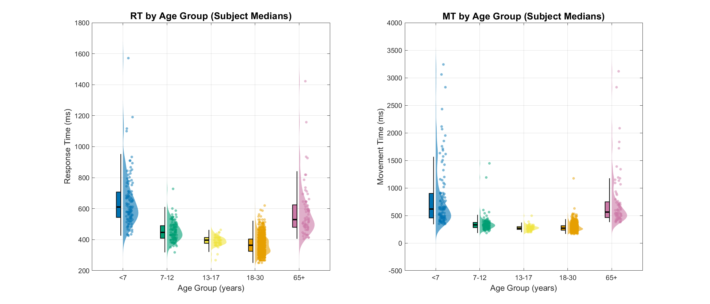

---
## Group-Based Weibull Models for SRT and MT

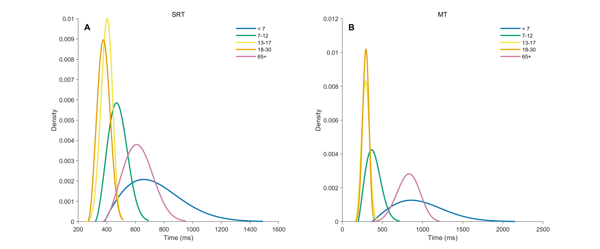

---
## SRT Parameter Distributions by Age Group

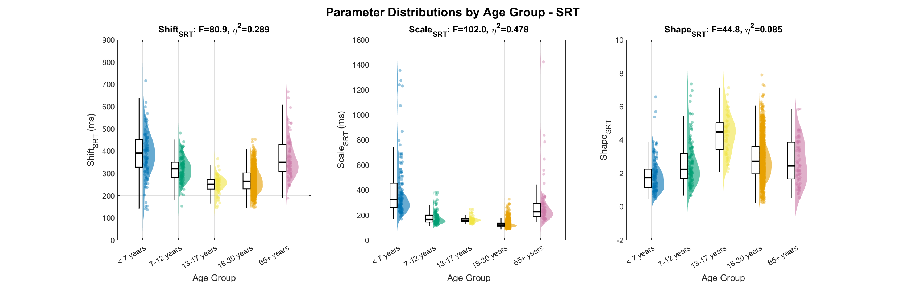

- $t_0$: 13–17 < **18–30** < 7–12 < {65+ ≈ <7}
- $\lambda$: **18–30** < {13–17 ≈ 7–12} < 65+ < <7
- $\kappa$: <7 < {7–12 ≈ 65+ ≈ **18–30**} < 13–17

---

## MT Parameter Distributions by Age Group

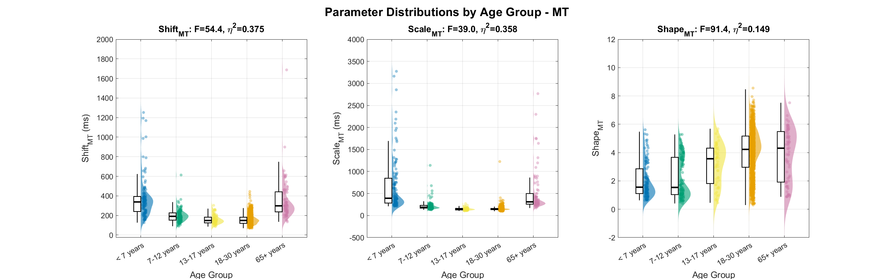

- $t_0$: {**18–30** ≈ 13–17} < 7–12 < {65+ ≈ <7}
- $\lambda$: {13–17 ≈ **18–30**} < 7–12 < {65+ ≈ <7}
- $\kappa$: {<7 ≈ 7–12} < 13–17 < {65+ ≈ **18–30**}
---

## Age-Group Differences

**Omnibus tests — all significant, *p* < .001:**

| DV | Parameter | Welch's *F* | $\eta^2$ | Magnitude |
|---|---|---|---|---|
| **SRT** | $\lambda$ | *F*(4,166) = 102.00 | **.478** | **Large** |
| **SRT** | $t_0$ | *F*(4,172) = 80.94 | .289 | Large |
| **SRT** | $\kappa$ | *F*(4,177) = 44.85 | .085 | Medium |
| **MT** | $t_0$ | *F*(4,168) = 54.36 | **.375** | **Large** |
| **MT** | $\lambda$ | *F*(4,169) = 38.96 | .358 | Large |
| **MT** | $\kappa$ | *F*(4,178) = 91.40 | .149 | Large |

**The critical crossing:** SRT → $\lambda$ dominates ($\eta^2$ = .478) | MT → $t_0$ dominates ($\eta^2$ = .375)

---

## Post-Hoc Contrasts vs. Young Adults (18–30 y)

#### SRT

| Group | $d_{t_0}$ | $d_{\lambda}$ | $d_{\kappa}$ |
|---|---|---|---|
| **<7 y** | **1.47\*** | **1.65\*** | **−0.83\*** |
| 7–12 y | 0.96\* | 1.26\* | −0.19 |
| 13–17 y | −0.40\* | 1.43\* | 1.24\* |
| **65+ y** | **1.38\*** | **1.16\*** | **−0.14** |

Children: **large effects on all three**

Older adults: **large $t_0$ & $\lambda$**, n.s. $\kappa$

#### MT

| Group | $d_{t_0}$ | $d_{\lambda}$ | $d_{\kappa}$ |
|---|---|---|---|
| **<7 y** | **1.42\*** | **1.19\*** | **−1.40\*** |
| 7–12 y | 0.73\* | 0.79\* | −1.17\* |
| 13–17 y | 0.08 | −0.07 | −0.57\* |
| **65+ y** | **1.28\*** | **1.05\*** | **−0.11** |

Children: **large effects on all three**

Older adults: **large $t_0$ & $\lambda$**, n.s. $\kappa$

\* *p* < .05 (Games-Howell); **bold** = key comparison groups

---

## Children Are Not Small Elderly
 

**Children's SRT profile** — elevated $t_0$, elevated $\lambda$, reduced $\kappa$:

- Not just slower on every trial — an **increased proportion of trials with substantial delays**
- Compatible with intermittent **attentional lapses** rather than a stable speed deficit

**Older adults' SRT profile** — elevated $t_0$ (largest), elevated $\lambda$, preserved $\kappa$:

- Large $t_0$: **elevated sensorimotor floor** (delayed response preparation)
- Better characterized as **compound slowing** with relatively preserved trial-to-trial consistency

> Children and older adults **differed significantly** on $\kappa$ ($d$ = −0.65, $p$ < .001) — children showed substantially more variable responding.

---

## Connection to Drift-Diffusion Models

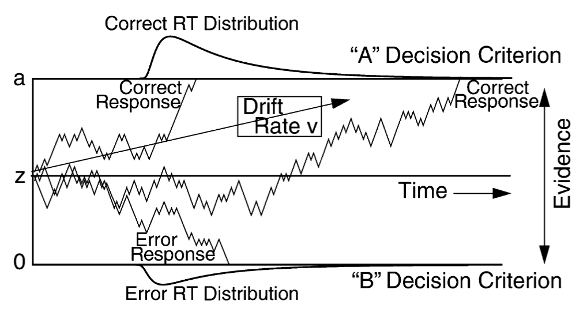

  

| DDM finding (Ratcliff et al.) | Weibull analog |
|---|---|
| Older adults: ↑ boundary separation + ↑ non-decision time | ↑ $t_0$ (sensorimotor floor), compound slowing |
| Children: ↓ drift rate + ↑ variability in non-decision time | ↑ $\lambda$ (reduced efficiency) + ↓ $\kappa$ (inconsistency) |

The Weibull decomposition **extends this dissociation to SRT**; DDM is not identifiable (no error responses).

The Weibull decomposes what DDM lumps together as non-decision time $T_{er}$.

---

## Convergence of Parameter Estimation

MCMC chains must converge before interpreting parameter estimates:

| Metric | What it checks | Criterion |
|---|---|---|
| $\hat{R}$ (Gelman–Rubin) | Do independent chains agree on the posterior? | < 1.10 |
| **ESS** (Effective Sample Size) | Are enough independent posterior draws available? | > 100 |

  

| DV | Criterion | Shift | Scale | Shape | Overall |
|---|---|---|---|---|---|
| **SRT** | $\hat{R}$ < 1.10 | 95.2% | 96.7% | 95.1% | 95.0% |
| **SRT** | ESS > 100 | 94.9% | 97.3% | 95.7% | 94.6% |
| **MT** | $\hat{R}$ < 1.10 | 97.8% | 99.4% | 98.4% | 97.7% |
| **MT** | ESS > 100 | 97.1% | 99.2% | 98.3% | 97.0% |

---

## Goodness-of-Fit Evaluation Strategy

 

| Metric | What it measures | Good fit |
|---|---|---|
| **RMSE** (ms) | Mismatch between model-predicted and observed quantiles (5th–95th) | Lower is better; < 50 ms for most groups |
| **MAPE** (%) | Same mismatch, normalized by RT magnitude — comparable across groups | < 5% indicates close fit |
| **90% Coverage** | Proportion of observed RTs falling within the model's 90% prediction interval | ≥ .90 (nominal); .94–.95 = well calibrated |
| **PP *p* $T_{min}$** | Does the model capture the **fastest** response? (posterior predictive check on minimum RT) | Near .50 = adequate; < .05 or > .95 = misfit |
| **PP *p* $T_{SD}$** | Does the model capture **trial-to-trial variability**? (posterior predictive check on RT *SD*) | Near .50 = adequate; < .05 or > .95 = misfit |

RMSE = Root Mean Square Error  
MAPE = Mean Absolute Percentage Error  
PP = Posterior Predictive

---

## Posterior Predictive Checks

**Idea:** If the model captured the data-generating process, simulated data should look like observed data.

**Procedure for each participant $i$:**

1. Draw one sample from the posterior: $(\hat{t}_{0i},\, \hat{\lambda}_i,\, \hat{\kappa}_i)$
2. Simulate $n_i$ trials: $RT_{ij}^{rep} = \hat{t}_{0i} + \text{Weibull}(\hat{\lambda}_i,\, \hat{\kappa}_i)$, where $n_i$ = number of observed trials
3. Compute a summary statistic on both the simulated set and the observed set — e.g., $T_{min}^{rep}$ vs. $T_{min}^{obs}$, or $T_{SD}^{rep}$ vs. $T_{SD}^{obs}$
4. Repeat across all posterior samples (32,000 draws)

**Posterior predictive *p*-value:**
$$p_B = \Pr(T^{rep} \geq T^{obs} \mid \text{data})$$

- $p_B \approx .50$ → simulated and observed statistics are well-matched
- $p_B < .05$ or $> .95$ → systematic misfit on that aspect of the data

We check $T_{min}$ (can the model recover the **fastest** response?) and $T_{SD}$ (can it recover **trial-to-trial spread**?)

---

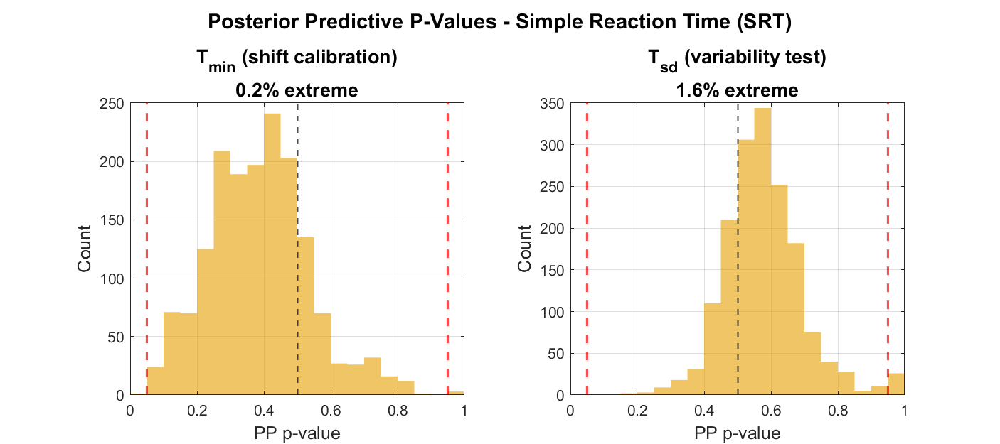

---
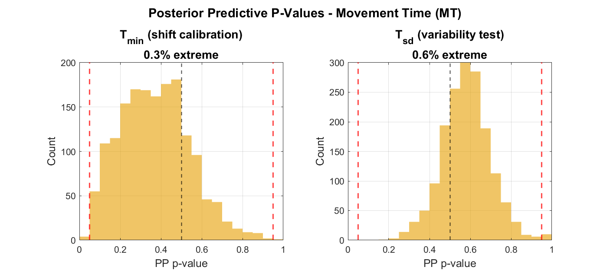

---
## Summary for Goodness-of-Fit Results
 

| DV | Age Group | RMSE (ms) | MAPE (%) | Coverage | PP *p* $T_{min}$ | PP *p* $T_{SD}$ |
|---|---|---|---|---|---|---|
| SRT | <7 y | 78.9 | 6.2 | 0.95 | 0.0% | 0.0% |
| SRT | 7–12 y | 23.1 | 3.6 | 0.95 | 0.0% | 0.0% |
| SRT | 13–17 y | 12.4 | 2.6 | 0.94 | 0.0% | 1.8% |
| SRT | 18–30 y | 22.3 | 3.6 | 0.95 | 0.3% | 1.9% |
| SRT | 65+ y | 42.3 | 3.7 | 0.95 | 0.0% | 0.0% |

Coverage (.94–.95) exceeds the .90 target — model is **well calibrated**.

---

## Methodological Contributions

1. **HBM for sparse data** — With 20 trials, MLE is unstable. HBM's partial pooling borrows strength across up to 1,297 participants. The advantage is greatest where most needed.

2. **Tablet-based distributional analysis** — Hardware-level SRT/MT separation without specialized equipment. Feasible in schools, community centers, clinical settings.

3. **Mandatory SRT/MT dissociation** — The crossing pattern ($\lambda$ dominates SRT, $t_0$ dominates MT) would be **completely obscured** by collapsing across both response phases.

---

## Limitations

| Limitation | Mitigation |
|---|---|
| 20-trial protocol | HBM recovers parameters comparable to MLE with more trials |
| Cross-sectional design | Consistent with longitudinal literature |
| Young adults = university students | Effect sizes remain large ($d$ = 0.83–1.65) |
| No middle-aged adults (30–65) | Future web-based study with continuous age coverage |
| Parameter interpretations not experimentally tested | SRT–MT crossing is non-circular evidence |

---

## Remaining works
 

1. **Correlation analysis** — add lapse component for participants with extreme slow responses
2. **Recovery analysis** = repeat HBM from simulating data with estimated hyperparameter distribution
3. **Clinical applications** — Weibull parameter distributions for PD patients
4. **Weibull–DDM bridge** — $t_0$ as decomposition of DDM non-decision time; developmental data as test bed

---

## Summary

> **The U-shaped RT trajectory across the lifespan is not the product of a single factor rising and falling.**

- Children's slow SRT reflects **reduced central efficiency + attentional inconsistency** (↑ $\lambda$, $d$ = 1.65; ↓ $\kappa$, $d$ = −0.83), on top of an elevated peripheral floor (↑ $t_0$, $d$ = 1.47)
- Older adults' slow SRT reflects primarily an **elevated sensorimotor floor** (↑ $t_0$, $d$ = 1.38) with compound central slowing (↑ $\lambda$, $d$ = 1.16) but **preserved consistency** ($\kappa$, $d$ = −0.14, n.s.)
- The **SRT–MT crossing** ($\lambda$ dominates SRT; $t_0$ dominates MT) validates the stage-based parameter interpretation
- **HBM** makes this decomposition feasible with sparse data
- **Tablet-based assessment** makes it deployable outside the laboratory

---

## References

- Bartzokis et al. (2010). Lifespan trajectory of myelin integrity. *Neurobiology of Aging*, 31(9).
- Cerella & Hale (1994). Rise and fall in information-processing rates. *Acta Psychologica*, 86.
- Der & Deary (2006). Age and sex differences in reaction time. *Psychology and Aging*, 21(1).
- Dykiert et al. (2012). Age differences in IIV. *PLoS ONE*, 7(10).
- Forrence et al. (2023). Age-related SRT slowing reflects slower response preparation.
- Kail (1991). Developmental change in speed of processing. *Psychological Bulletin*, 109(3).
- Ratcliff et al. (2006, 2012). Aging and the drift-diffusion model.
- Rouder et al. (2003). HBM framework for RT distributions. *Psychometrika*, 68(4).
- Rouder et al. (2005). Hierarchical model for RT distributions. *Psychonomic Bulletin & Review*, 12(2).
- Salthouse (1996). Processing-speed theory. *Psychological Review*, 103(3).
- Williams et al. (2005). Inconsistency in RT across the life span. *Neuropsychology*, 19(1).
